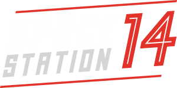

<p align="center"> </p>

[Pax Astralis](https://github.com/Pax-Astralis-Dev/pax-astralis-station) is a fork of [Frontier Station 14](https://github.com/new-frontiers-14/frontier-station-14) which is a fork of [Space Station 14](https://github.com/space-wizards/space-station-14) that runs on [Robust Toolbox](https://github.com/space-wizards/RobustToolbox), our homegrown engine written in C#.

If you want to host or create content for SS14, this is the repo you need. It contains both RobustToolbox and the content pack for development of new content packs.

## Links

[Website](https://spacestation14.io/) | [SS14 Discord](https://discord.ss14.io/) | [Forum](https://forum.spacestation14.io/) | [Steam](https://store.steampowered.com/app/1255460/Space_Station_14/) | [Standalone Download](https://spacestation14.io/about/nightlies/)

## Documentation/Wiki

The [wiki](https://docs.spacestation14.com/) has documentation on FS14s content.

## Contributing

We are happy to accept contributions from anybody. Get in Discord if you want to help. We've got a [list of ideas](https://discord.com/channels/1123826877245694004/1127017858833068114) that can be done and anybody can pick them up. Don't be afraid to ask for help either!

We are not currently accepting translations of the game on our main repository. If you would like to translate the game into another language consider creating a fork or contributing to a fork.

## Building

0. Download dotnet
   ```sh
   # arch
   pacman -Syu dotnet-runtime dotnet-sdk dotnet-runtime-7.0 dotnet-sdk-7.0
   ```
1. Clone this repo.
   ```sh
   git clone --recursive https://github.com/Pax-Astralis-Dev/pax-astralis-station
   ```
2. Run `RUN_THIS.py` to init submodules and download the engine.
3. Compile the solution.
   ```sh
   dotnet run --project Content.Server
   dotnet run --project Content.Client
   ```

[More detailed instructions on building the project.](https://docs.spacestation14.com/)

## License

All code for the content repository is licensed under [MIT](https://github.com/space-wizards/space-station-14/blob/master/LICENSE.TXT).

Most assets are licensed under [CC-BY-SA 3.0](https://creativecommons.org/licenses/by-sa/3.0/) unless stated otherwise. Assets have their license and the copyright in the metadata file. [Example](https://github.com/space-wizards/space-station-14/blob/master/Resources/Textures/Objects/Tools/crowbar.rsi/meta.json).

Note that some assets are licensed under the non-commercial [CC-BY-NC-SA 3.0](https://creativecommons.org/licenses/by-nc-sa/3.0/) or similar non-commercial licenses and will need to be removed if you wish to use this project commercially.
